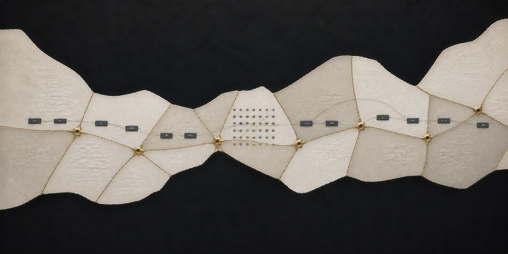

# Kintsugi

**Can a language model be repaired repeatedly without making it harder to learn the next task?**

Teaching a model something new can weaken behavior it already had. An earlier
checkpoint can help restore that behavior—but recovering a score is not the same
as recovering everything that made the model useful.

Kintsugi asks whether repeated repair preserves future learning, earlier skills,
and varied valid answers—or leaves a little debt behind.

**Status · v2 calibration, 31 August 2026.** Calibration is incomplete and the
runner is currently stopped on a checkpoint-saving error. The main experiment
has not started; there are no v2 study conclusions yet.

## The experiment

We use **Qwen3.5-4B with rank-32 LoRA**, starting every training trajectory from
the same checkpoint. The planned study has seven task types, four counterbalanced
task orders, and three policies: **twelve trajectories in total**.

| Policy | What happens after learning |
|---|---|
| Learn-only | Keep learning, with no repair. This is the control. |
| Fixed anchor | Repair toward the original model checkpoint. |
| Rolling anchor | Repair toward the previous post-repair checkpoint. |

Both repair policies use the original checkpoint in cycle one. After that: do we
preserve the model we started with, or the model we most recently restored?

The seven task slots cover derivation, language modelling, executable generation,
extraction, number representation, string transformations, and domain-specific
text. [Primary candidates](SPEC.md#3-learning-tasks) include arithmetic,
Icelandic, SQL, JSON extraction, base conversion, string programs, and legal text.
Each has a predeclared backup; calibration determines which qualifies.

Task data, example order, and evaluations are reused across orders, with repair
randomness paired by task. These orders test different learning histories;
they are not independent random seeds.

## One cycle

1. **Learn something genuinely new.** In the repair arms, training continues
   until task competence is reached and instruction-following falls into the
   damage band: 60–85% of its original score, subject to a 120-update cap.
   A held-out check tests generalization. The learn-only control stops at competence
   plus the required learning gain, without waiting for damage.
2. **Measure before repair.** Save checkpoint A and run the measurements below.
3. **Repair.** The model generates answers; an earlier checkpoint supplies
   token-level feedback through on-policy reverse-KL distillation. Stop at the
   first scheduled check reaching at least 95% of the original instruction-following
   score, or after 150 updates.
4. **Measure again, then continue.** Save checkpoint B, repeat the measurements,
   and move to the next task.

If no repair is needed, we skip it: zero work is **not a measured repair effect**.
Failed repairs remain outcomes rather than being filtered out. The primary
comparison uses individual cycles with genuine acquisition and comparable
in-band damage—not a requirement that every cycle in a trajectory be perfect.

## What we look for

- **Future learning:** two fixed probes, one structured and one language-based.
  We time progress halfway toward a fixed reference (`t50`) and a fixed loss
  reduction from each checkpoint's own start (`tΔ`). Agreement helps distinguish
  changed learning dynamics from simply starting with a lower loss.
- **Memory:** performance on earlier tasks, normalized by the improvement
  originally acquired on each. Native task scores remain visible too.
- **Diversity:** a separate, exactly checkable multi-solution panel tests whether
  eight attempts uncover more valid solutions and strategy families than one.
- **Maintenance:** learning exposure and repair effort, distinguishing the
  literal workload from the cost of repairing comparable damage.

A 60-prompt instruction-following suite controls stopping; 30 separate prompts
test generalization, all scored by programmatic checkers. A small weight-and-drift
panel adds descriptive context.

Claims must clear practical-effect margins, measurement-noise bounds, and
coverage requirements, with consistent directions across task orders. A flat
result is not proof that repeated repair is harmless.

## Before the full run

Each selected task must produce genuine learning, valid damage, and successful
repair on two disjoint trials. A three-cycle rehearsal tests persistence. Both
probes must retain room to measure learning across the resulting checkpoints.

Noise estimates use three independent complete repeats. Every probe repeat must
yield both measurable clocks; incomplete repeats cannot be dropped to make a
probe pass. If the registered options cannot meet the calibration gates, we stop.
Otherwise, selections are frozen before a separate main-study launch authorization.

## The first time around

[Kintsugi v1](https://github.com/ely2ba/kintsugi-v1/tree/v1-final) completed all
35 lineage-cycles, but did not sustain comparable damage across cycles: only
**5 of 28 repair-arm cycles** landed in the intended band. Related expression
tasks appeared to transfer to one another, the absolute-reduction learning clock
sometimes ran out of headroom, and all trajectories shared one task order.
The study could not issue its registered repair-debt or restoration claims.

The lesson was to validate the *repeated challenge*, not just the first repair.
That is why v2 changes the tasks, damage rule, orders, and probe validation.
V1 is closed; its data do not enter v2. The [report](https://github.com/ely2ba/kintsugi-v1/blob/v1-final/REPORT.md)
and [diagnostic memo](https://github.com/ely2ba/kintsugi-v1/blob/v1-final/DIAGNOSTIC_MEMO.md)
keep the full story.

## Where this fits

The recipe builds on [Thinking Machines' on-policy distillation](https://thinkingmachines.ai/blog/on-policy-distillation/).
[Regenerative regularization](https://arxiv.org/abs/2308.11958) motivates asking
whether returning toward an earlier state preserves learning ability, but weight
regularization is not checkpoint distillation. Sequential self-distillation has
also been studied: [Denser ≠ Better](https://arxiv.org/abs/2607.01763) reports
forgetting and collapse with a different continual self-distillation method.

Our focus is narrower: **repeated post-hoc damage and repair, with comparable
starting damage and an explicit recovery criterion, while measuring what that
criterion might miss.** This is a discovery study in one model and a fixed task
set—not a universal verdict on distillation.

## Read further

[Scientific specification](SPEC.md) · [Data and order manifests](manifests/) ·
[Code and execution notes](OPERATIONS.md) · [Study provenance](PROVENANCE.md)
